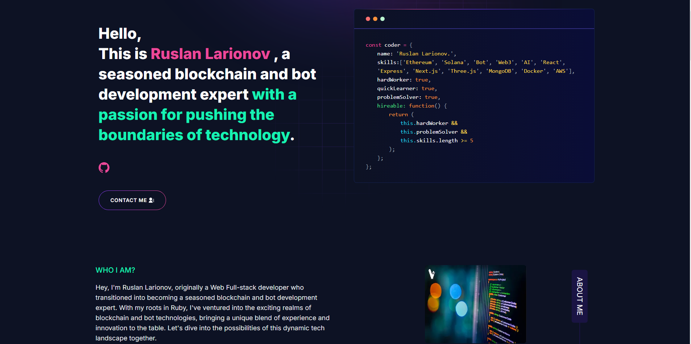

# 👋 Hello, I'm a senior Fullstack and Blockchain develoepr!

Welcome to my GitHub profile. I'm a blockchain and bot expert passionate about leveraging technology to build innovative solutions. You'll find a collection of my open-source projects, contributions, and ongoing research. Join me on this exciting journey of innovation and technology! 🚀 

<!-- Blockchain -->

<!-- Ethereum -->

<!-- Solana -->

<!-- Solidity -->

<!-- Rust -->

<!-- Web3.js -->

<!-- Bot -->

<!-- Telegram Bot -->

<!-- Discord Bot -->

<!-- Whatsapp Bot -->

<!-- AI -->

<!-- Ruby -->

<!-- React -->

<!-- Vue.js -->

<!-- Angular -->

<!-- Express.js -->

<!-- Next.js -->

<!-- MongoDB -->

<!-- MySQL -->

<!-- PostgreSQL -->

<!-- Firebase -->

<!-- JavaScript -->

<!-- TypeScript -->

<!-- Node.js -->

<!-- C++ -->

<!-- Python -->

<!-- Django -->

<!-- Laravel -->

<!-- PHP -->

<!-- WordPress -->

<!-- HTML -->

<!-- CSS -->

<!-- Git -->

<!-- Docker -->

<!-- Android -->

<!-- Java -->

<!-- Kotlin -->

<!-- AWS -->

<!-- Azure -->

<!-- Google Cloud -->

<!-- Heroku -->

<!-- Kubernetes -->

<!-- Redis -->

## My Portfolio

<!--  -->

## About Me

- 👨‍💻 I specialize in blockchain technology, particularly Ethereum and Solana.
- 🤖 I'm also an expert in bot development, creating chatbots and automation tools.
- 🌱 I'm constantly learning and exploring new advancements in the blockchain and bot space.
- 💬 Feel free to reach out to me for discussions on blockchain, bot development, or any related topics.

## Projects

    

        <a href="https://shibamemu.com/" target="_blank">
            <h3>Shiba Memu</h3>
            
Where blockchain meets AI innovation! Join us in the DeFi adventure as we unleash the power of technology to revolutionize the crypto landscape. With us, the future is pawsitively bright!

            
        </a>
    

    

        <a href="https://stake.arbinucoin.com/" target="_blank">
            <h3>Arbinu Coin Staking Platform</h3>
            
Where DeFi meets whimsy! Seamlessly bridge blockchains, explore projects, stake assets for passive income, and farm for rewards. Laugh, earn, and play in the crypto cosmos! 🐾

            
        </a>
    

    

        <a href="https://token.altsignals.io/" target="_blank">
            <h3>AltSignals Token</h3>
            
AltSignals is set to soar with AI, ML, NLP, and sentiment analysis. 🚀 Traders benefit from automated, 24/7 trading and advanced analysis support.

            
        </a>
    

    

        <a href="https://growprotocol.net/" target="_blank">
            <h3>Grow Protocol</h3>
            
Grow Protocol will provide the first real passive income in the industry. Stake USDT, Earn USDT, 25% APY, no lies. Start earning today with Grow.

            
        </a>
    

## Experience

- 💼 Over 6 years of experience as a Blockchain and Bot Expert, specializing in Ethereum, Solana, and bot development.
- 🚀 Successfully developed and deployed multiple blockchain projects, including decentralized applications (DApps), smart contracts, and blockchain-based solutions.
- 🤖 Extensive expertise in bot development, creating chatbots, automation tools, and integrations with popular messaging platforms.

## Development

- 🌐 Developed and maintained several blockchain projects, contributing to the growth and innovation of the blockchain ecosystem.
- 🤖 Created robust and scalable bots for various applications, enhancing user engagement and streamlining processes in different industries.

## Contributions

- 📚 Shared knowledge and insights through blog posts, tutorials, and contributions to open-source projects in the blockchain and bot development communities.
- 🌟 Actively participated in discussions, forums, and meetups to exchange ideas, collaborate with peers, and stay updated on the latest advancements in technology.

## Recognition

- 🏆 Recognized for technical expertise and contributions to the field of blockchain and bot development, earning respect and admiration from peers and industry professionals.
- 🎤 Invited as a speaker at conferences, webinars, and events to share experiences, insights, and best practices in blockchain and bot development.

## Thanks for Visiting!

Thanks for stopping by! Feel free to connect with me or explore my projects. Have a great day! 😊
